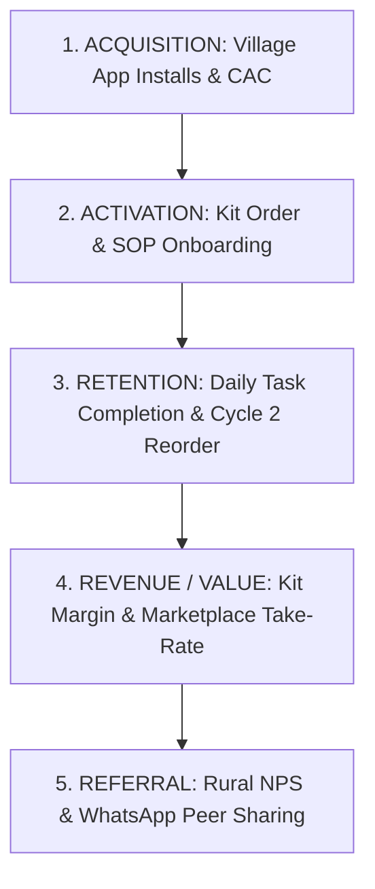

# AgriConnect: Product Metrics & Analytics Framework

---

## 1. The North Star Metric (NSM)

```
┌────────────────────────────────────────────────────────────────────────────────────────┐
│  NORTH STAR METRIC (NSM):                                                              │
│  "Net Additional Monthly Income Generated per Active Farmer (₹/Farmer/Month)"          │
│                                                                                        │
│  Formula:                                                                              │
│             ∑ (Gross Harvest B2B Sales Revenue − Kit & Operational Costs)              │
│      NSM = ───────────────────────────────────────────────────────────────             │
│                         Total Active Cultivating Farmers                               │
│                                                                                        │
│  Target Benchmark (Hypothesis): ≥ ₹8,500 / Farmer / Month                              │
└────────────────────────────────────────────────────────────────────────────────────────┘
```

### Why This is the North Star Metric
1. **Direct Value Alignment**: Represents genuine economic transformation for smallholders (holding <5 acres), directly solving the #1 root problem: stagnant household income on traditional staples.
2. **Reflects Complete Product Health**: A farmer only earns net income if:
   * They discover a viable blueprint (Discovery)
   * They order and receive certified inputs (Fulfillment)
   * They follow daily SOP checklists without crop loss (Engagement & Agronomy)
   * They successfully sell their harvest to verified buyers (Marketplace Liquidity)
3. **Business Ecosystem Sustainability**: As farmer net income rises, repeat cycle reorders (LTV) and marketplace transaction volume (GMV) grow proportionally.

---

## 2. AARRR Pirate Funnel Metrics



| Funnel Stage | Key Metric Name | Exact Mathematical Formula | Business / Product Purpose | Target Benchmark *(Initial Hypothesis)* | Data Source & Tracking Method |
|:---|:---|:---|:---|:---:|:---|
| **Acquisition** | **Village Penetration Rate** | \(\frac{\text{Unique Farmer Installs in Cluster}}{\text{Total Smartphone-Owning Farmers in Cluster}} \times 100\) | Measures market capture efficiency in targeted village clusters. | **\(\ge 40\%\)** of village smallholders | Mobile App Installs via Village Geo-Fencing |
| **Acquisition** | **Customer Acquisition Cost (CAC)** | \(\frac{\text{Total Village Activation & Marketing Spend}}{\text{Total Verified Farmer Installs}}\) | Tracks cost efficiency of ground chaupal demos and KVK partnerships. | **\(\le ₹120\)** per active install | Marketing Spend Ledger / Branch Analytics |
| **Activation** | **Blueprint-to-Kit Conversion** | \(\frac{\text{Farmers Ordering a Starter Kit within 14 Days}}{\text{Total Unique Users Exploring a Blueprint}} \times 100\) | Measures intent-to-action conversion; validates trust in COD and pricing. | **\(\ge 25\%\)** conversion rate | Funnel Events: `view_blueprint` \(\to\) `order_kit` |
| **Activation** | **Day 1 Task Onboarding Rate** | \(\frac{\text{Farmers Completing Day 1 Setup SOP}}{\text{Total Farmers Receiving Starter Kit}} \times 100\) | Validates smooth kit unboxing and initial crop initiation. | **\(\ge 90\%\)** completion rate | Event: `task_complete_day_01` |
| **Retention** | **Daily SOP Task Completion Rate** | \(\frac{\text{Total Daily Tasks Marked Completed on Schedule}}{\text{Total Scheduled Tasks for Active Batches}} \times 100\) | Measures core product engagement and adherence to agronomic guidelines. | **\(\ge 80\%\)** adherence | Event: `daily_task_complete` / Time-series logs |
| **Retention** | **Harvest Completion Rate** | \(\frac{\text{Batches Successfully Harvested (Day 40–45)}}{\text{Total Batches Initiated with Starter Kit}} \times 100\) | Core agronomic success rate; proves prevention of crop failure. | **\(\ge 85\%\)** batch success | Harvest broadcast logs / Buyer pickup slips |
| **Retention** | **Cycle 2 Reorder Retention** | \(\frac{\text{Farmers Ordering Batch 2 Kit within 30 Days of Harvest}}{\text{Total Farmers Successfully Completing Cycle 1}} \times 100\) | Measures long-term customer retention and sustainable enterprise adoption. | **\(\ge 70\%\)** repeat rate | Cohort Retention Analysis (30-day post harvest) |
| **Revenue / Value** | **Starter Kit Gross Margin** | \(\frac{\text{Kit Retail Price (₹3,200)} - \text{COGS \& Delivery Cost}}{\text{Kit Retail Price}} \times 100\) | Direct unit economic profitability on physical incubation starter packs. | **18.0\% – 22.0\%** gross margin | ERP & Fulfillment Ledger |
| **Revenue / Value** | **B2B Marketplace Take Rate** | \(\frac{\text{Commission Fee Charged to Commercial Buyer}}{\text{Gross Produce Transaction Value (GMV)}} \times 100\) | Monetization fee for providing verified, graded, consolidated local produce. | **3.5\% – 5.0\%** of GMV | Escrow / Settlement Ledger |
| **Revenue / Value** | **Buyer Payout Settlement Time** | \(\text{Time Elapsed between Produce Handover and Cash/UPI Settlement}\) | Builds unbreakable financial trust with smallholders. | **\(\le 6\) Hours** post-pickup | Bank Webhook / UPI Transaction Logs |
| **Referral** | **Rural Net Promoter Score (NPS)** | \(\% \text{ Promoters (9–10)} - \% \text{ Detractors (0–6)}\) | Measures authentic word-of-mouth advocacy in rural farming communities. | **NPS \(\ge 65\)** | In-app Audio Survey at Harvest Settlement |
| **Referral** | **Viral Coefficient (\(K\)-factor)** | \(\text{Invites Sent per Farmer} \times \text{Conversion Rate of Invites}\) | Measures organic peer growth via 1-tap WhatsApp family/neighbor sharing. | **\(K \ge 0.45\)** | WhatsApp Deep-Link Attribution Tracking |

---

## 3. Guardrail Metrics (Quality & Safety Safeguards)

Guardrail metrics ensure we do not optimize growth at the expense of farmer livelihood, trust, or operational safety.

```
┌────────────────────────────────────────────────────────────────────────────────────────┐
│                                   GUARDRAIL METRICS                                    │
├────────────────────────────────────────────────────────────────────────────────────────┤
│  1. Crop Contamination / Mortality Rate : Target < 6.0% (Alert if > 6.0%)              │
│     • Measures crop failure. If breached, triggers mandatory agronomist field visit.   │
│                                                                                        │
│  2. Buyer Default / No-Show Rate        : Target < 2.0% (Alert if > 2.0%)              │
│     • Measures buyer reliability. If breached, platform guarantees minimum floor payout│
│                                                                                        │
│  3. App Crash & Offline Sync Failure    : Target < 0.5% (Alert if > 0.5%)              │
│     • Ensures zero task loss in remote rural connectivity zones.                       │
│                                                                                        │
│  4. Dialect Voice Recognition Error Rate: Target < 8.0% (Alert if > 8.0%)              │
│     • Ensures non-literate farmers are never stranded due to ASR failure.              │
└────────────────────────────────────────────────────────────────────────────────────────┘
```

---

## 4. Analytics Implementation & Event Tracking Schema

### Key Core Events Instrumented in App

```json
{
  "events": [
    {
      "event_name": "voice_query_triggered",
      "properties": ["dialect", "query_text", "confidence_score", "is_fallback"]
    },
    {
      "event_name": "roi_calculated",
      "properties": ["venture_type", "selected_space_sqft", "selected_budget", "projected_net_profit"]
    },
    {
      "event_name": "starter_kit_ordered",
      "properties": ["kit_sku", "amount", "payment_mode", "delivery_pincode", "village"]
    },
    {
      "event_name": "daily_task_completed",
      "properties": ["cycle_day", "task_id", "video_watched_duration_sec", "completed_on_schedule"]
    },
    {
      "event_name": "sos_doctor_requested",
      "properties": ["cycle_day", "photo_attached", "symptom_tag", "time_to_agronomist_callback_min"]
    },
    {
      "event_name": "buyer_bid_accepted",
      "properties": ["buyer_id", "agreed_rate_per_kg", "total_volume_kg", "total_payout_amount"]
    },
    {
      "event_name": "harvest_payout_settled",
      "properties": ["batch_id", "payout_method", "settlement_time_hours", "net_profit_earned"]
    }
  ]
}
```
