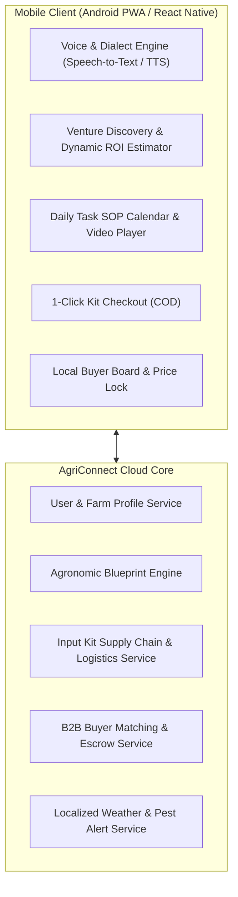

# AgriConnect: Product Requirements Document (PRD)

| Document Version | Author | Status | Target Release | Last Updated |
|:---|:---|:---|:---|:---|
| **v1.0 (MVP Specification)** | Product Management Team (IIT Kharagpur) | Approved for Dev | Q4 2026 / Alpha Release | September 2026 |

---

## 1. Product Overview & Executive Summary

**AgriConnect** is a mobile-first micro-enterprise incubation platform and marketplace tailored for India’s small and marginal farmers (holding <5 acres). The platform bridges the massive **68.5 percentage point drop-off between agribusiness intention (87.0%) and execution (18.5%)** by providing zero-friction vernacular execution blueprints, curated low-cost starter kits (<₹3,500), and guaranteed local B2B buyer off-take linkages.

---

## 2. Background & Strategic Context

In primary field research conducted across 7 villages with 92 farmers:
* **76.1% of farmers own <5 acres** (Mean: 4.12 acres), trapped in low-margin commodity staples (Wheat, Soyabean, Corn) with stagnant returns and recurring input debt cycles (29.3% cite "Money" as their #1 problem).
* **87.0% (80/92) want to start an agribusiness** (100% of farmers under 45 yrs), but only 18.5% (17/92) currently do so due to a massive **knowledge and training deficit (56.5%)**.
* **100% of diversified farmers (17/17) experienced net income increases**.
* **38.0% of respondents are illiterate**, mandating a voice-assisted, zero-text visual mobile architecture.
* **98.9% received zero government assistance**, proving that private product innovation is necessary to bridge the rural extension void.

---

## 3. Problem Statement

> **"Small and marginal farmers (holding <5 acres) in rural India struggle to diversify into high-margin agribusinesses and modern agricultural practices because they lack structured, actionable training, practical know-how, and reliable market linkages, resulting in perpetual dependency on low-margin traditional crops, stagnant household incomes, and persistent vulnerability to poverty."**

---

## 4. Target Users & Stakeholders

| Stakeholder Tier | User Profile | Primary Pain Point | Core Need from AgriConnect |
|:---|:---|:---|:---|
| **Primary User (P0)** | **Ramesh Ahirwar** (Young Smallholder, 25–45 yrs, <5 ac, smartphone owner) | Unstructured YouTube videos; fear of losing capital on mistakes. | Bite-sized daily visual SOPs + <₹3,500 starter kit + local buyer off-take. |
| **Secondary User (P1)** | **Babulal Lodhi** (Marginal Non-Literate Farmer, 38% of survey) | Cannot read app text; extreme working capital constraints. | 100% voice navigation in local dialect + low-capex backyard venture blueprints. |
| **Commercial User (P2)** | **Virendra Patel** (Commercial Diversifier, 5–10 ac, 20.7% of survey) | Mandi cartel price cuts (21.1% cite market support as #1 problem). | Direct B2B commercial off-take contracts + multi-mandi price intelligence. |
| **Ecosystem Partner** | **Certified Input Labs & Local B2B Buyers** (Hotels, restaurants, mandi traders) | Inconsistent smallholder quality; unorganized procurement. | Steady, graded supply of fresh high-value produce and reliable spawn demand. |

---

## 5. Goals & Non-Goals

### A. Product & Business Goals
* **G1 (Conversion to Action)**: Achieve >30% conversion from venture blueprint exploration to Starter Kit ordering within 14 days of install.
* **G2 (Harvest Completion Rate)**: Achieve >85% successful crop harvest completion for farmers following the daily SOP task planner.
* **G3 (Income Impact)**: Deliver a verified minimum net earnings increase of ₹8,000–₹12,000 per farmer per 45-day cycle on a 150 sq.ft micro-unit.
* **G4 (Accessibility)**: Achieve >90% task completion rate on core user flows by non-literate users using voice assistance.

### B. Strict Non-Goals (Out of Scope for MVP)
* **NG1**: No open commodity trading for bulk staples (Wheat/Soybean/Paddy).
* **NG2**: No generic agrochemical/fertilizer retail catalog (avoid competing with AgroStar/DeHaat).
* **NG3**: No IoT sensor or automated greenhouse hardware requirements.
* **NG4**: No dedicated cold-chain logistics fleet (utilize local buyer pickup).

---

## 6. Detailed User Stories & Acceptance Criteria

### User Story 1: Voice-Guided Micro-Venture Discovery & ROI Calculator (P0)
* **Story**: *As an aspiring smallholder farmer (Ramesh), I want to see which agribusiness I can start with my available space and budget, so that I can understand my expected profit before risking any capital.*
* **Acceptance Criteria (Gherkin)**:
  ```gherkin
  Scenario: Calculating ROI for 100 sq.ft indoor space with ₹3,000 budget
    Given the farmer opens the AgriConnect app in Hindi/Malvi voice mode
    When the farmer selects "100 sq.ft spare room" and "₹3,000 budget"
    Then the app must display "Oyster Mushroom Blueprint" as the #1 match
    And show a visual summary: "Initial Cost: ₹2,800 | Harvest Time: 45 Days | Expected Net Profit: ₹11,500"
    And play an auto-narrated voice summary in the selected regional dialect.
  ```

### User Story 2: 1-Click Certified Starter Kit Procurement (P0)
* **Story**: *As a marginal farmer (Babulal), I want to order all required starter materials in one certified bundle with Cash on Delivery, so that I don't have to search in distant towns or risk buying fake seeds/spawns.*
* **Acceptance Criteria (Gherkin)**:
  ```gherkin
  Scenario: Ordering an Oyster Mushroom Starter Kit
    Given the farmer has reviewed the Oyster Mushroom Blueprint
    When the farmer taps "Order Starter Kit (₹2,800 COD)"
    Then the system confirms delivery to the village within 4 business days
    And includes certified spawn (5 kg), substrate bags (10 units), spray nozzle, and visual manual
    And sends an automated voice confirmation call in local dialect.
  ```

### User Story 3: Day-by-Day Visual SOP Task Calendar (P0)
* **Story**: *As a first-time grower (Ramesh), I want daily step-by-step instructions on my phone, so that I know exactly what to do each morning to keep my crop healthy.*
* **Acceptance Criteria (Gherkin)**:
  ```gherkin
  Scenario: Executing Day 12 incubation task
    Given the farmer's mushroom cycle is on Day 12
    When the farmer opens the app at 8:00 AM
    Then the home screen displays a prominent single task card: "Day 12: Maintain Humidity"
    And shows a 45-second auto-playing video demo on spraying water twice daily
    And allows the farmer to mark the task complete via a single large green check button.
  ```

### User Story 4: Pre-Harvest Local B2B Buyer Matchmaking (P0)
* **Story**: *As a diversified producer (Ramesh/Virendra), I want to link with confirmed local buyers 7 days before harvest, so that my perishable produce is sold immediately without distress pricing.*
* **Acceptance Criteria (Gherkin)**:
  ```gherkin
  Scenario: Matching mushroom harvest with local buyers
    Given the farmer's crop is 7 days away from harvest (Day 38 of 45)
    When the app prompts the farmer to confirm estimated harvest quantity (e.g., 40 kg)
    Then the platform matches the listing with 3 verified local commercial buyers (Hotels/Wholesalers)
    And locks in a transparent floor price range (₹120–₹150/kg)
    And generates a buyer pickup schedule at the village collection point.
  ```

---

## 7. Functional Requirements Specification (FRD)



### Module 1: Voice & Dialect Engine (FR-01)
* **FR-01.1**: App must support one-touch microphone interaction across all primary screens.
* **FR-01.2**: Support Hindi and regional dialects (Malvi/Nimadi) using lightweight speech-to-text.
* **FR-01.3**: All instructional content must have integrated Text-to-Speech (TTS) audio narration.

### Module 2: Venture Discovery & ROI Engine (FR-02)
* **FR-02.1**: Interactive visual sliders for available space (50 sq.ft to 1 acre) and budget (₹1,000 to ₹50,000).
* **FR-02.2**: Dynamic calculation of capital required, payback period, and projected monthly net profit based on regional mandi prices.

### Module 3: Daily SOP Task Engine (FR-03)
* **FR-03.1**: Automated time-series task generator mapped to crop cycle (Day 1 to Day 60).
* **FR-03.2**: Daily push notification with visual task cards (<3 min video demo, audio guidance).
* **FR-03.3**: Offline caching of weekly video/audio assets to enable access in zero-connectivity rural zones.

### Module 4: Starter Kit E-Commerce & Fulfillment (FR-04)
* **FR-04.1**: Standardized SKU catalog for certified micro-agribusiness kits (<₹3,500).
* **FR-04.2**: Support Cash on Delivery (COD) and digital UPI payments.
* **FR-04.3**: SMS and automated IVR voice tracking of delivery status to rural pin-codes.

### Module 5: B2B Micro-Marketplace & Buyer Connect (FR-05)
* **FR-05.1**: Automated pre-harvest trigger on Day \(N-7\) to broadcast harvest volume to verified buyers.
* **FR-05.2**: Buyer interface for local restaurants, hotels, and traders to place bids or accept fixed floor prices.
* **FR-05.3**: Digital receipt generation and payment status tracker.

---

## 8. User Flows & System Architecture

```mermaid
sequenceDiagram
    autonumber
    actor Farmer as Ramesh (Smallholder Farmer)
    participant App as AgriConnect Mobile App
    participant Core as AgriConnect Backend
    participant Input as Certified Spawn Supplier
    participant Buyer as Local Commercial Buyer

    Farmer->>App: Opens app & speaks "Mushroom shuru karna hai" (Voice Search)
    App->>Core: Fetch Mushroom Blueprint (100 sq.ft, ₹2,800 capex)
    Core-->>App: Display ROI: ₹11,500 Net Profit in 45 Days
    Farmer->>App: Taps "Order Starter Kit (COD)"
    App->>Input: Dispatch certified spawn & substrate to village
    Input-->>Farmer: Kit delivered in 4 days with COD receipt
    
    loop Daily Cultivation Cycle (Day 1 to 45)
        Core->>App: Push daily visual SOP task (e.g. "Day 15: Water Spray")
        Farmer->>App: Watches 45s video & taps "Task Done"
    end
    
    Core->>App: Day 38: "Harvest in 7 days. Confirm 40 kg volume?"
    Farmer->>App: Confirms harvest volume via voice
    Core->>Buyer: Broadcast verified fresh batch (40 kg Oyster Mushroom)
    Buyer->>Core: Accepts purchase at ₹130/kg (₹5,200 batch)
    Core-->>Farmer: Buyer Confirmed! Pickup scheduled at Village Center
```



---

## 9. Edge Cases & Error Handling

| Edge Case | Failure Scenario | System Handling & Mitigation |
|:---|:---|:---|
| **EC-01: Zero Internet Connectivity** | Farmer opens app in field with no 4G signal. | App operates in offline mode; caches 7 days of SOP tasks and videos locally; syncs task completion when signal resumes. |
| **EC-02: Crop Discoloration / Contamination** | Farmer notices green mold on Day 18. | Farmer taps "Emergency Help", takes photo; app routes to agronomist queue for voice callback within 3 hours. |
| **EC-03: Local Buyer Default / No Show** | Matched buyer fails to collect perishable harvest. | Secondary backup buyer pool auto-notified; platform provides minimum price guarantee pool for verified SOP followers. |
| **EC-04: Non-Literate User Input Errors** | Illiterate user gets stuck on confirmation dialog. | Auto-voice prompt triggers after 10 seconds of inactivity: *"To confirm your order, press the big green button"*. |

---

## 10. Success Metrics (AARRR & North Star)

```
┌────────────────────────────────────────────────────────────────────────────────────────┐
│  NORTH STAR METRIC:                                                                    │
│  "Net Additional Monthly Income Generated per Active Farmer (Target: ≥₹8,000/month)"   │
└────────────────────────────────────────────────────────────────────────────────────────┘
```

* **Acquisition**: Number of verified rural installs per village cluster (Target: >150 farmers/village).
* **Activation**: % of registered users who complete a Blueprint calculation and order a Starter Kit (Target: >25%).
* **Engagement / Task Completion**: % of daily SOP tasks completed on schedule (Target: >80%).
* **Retention (Cycle Repeat)**: % of farmers who initiate a second crop cycle after completing cycle 1 (Target: >70%).
* **Referral**: Net Promoter Score (NPS) among rural users (Target: >65) and organic peer referrals.

---

## 11. Risks, Mitigations & Key Assumptions

| Risk Category | Identified Risk | Severity | Mitigation Strategy |
|:---|:---|:---:|:---|
| **Supply Chain Risk** | Spawn/seed contamination during rural transit. | High | Partner with ICAR/KVK certified regional bio-labs; tamper-proof insulated packaging. |
| **Market Risk** | Perishable produce price collapse during peak season. | High | Pre-harvest forward contract matching; multi-buyer demand pooling. |
| **Adoption Risk** | Illiterate farmers abandon digital tasks. | Medium | Voice-first UX, gamified pictorial badges, and local village champion network. |
| **Agronomic Risk** | Unseasonal heatwave kills mushroom pinheads. | Medium | Dynamic climate sensor alerts pushing urgent misting/ventilation SOP overrides. |
