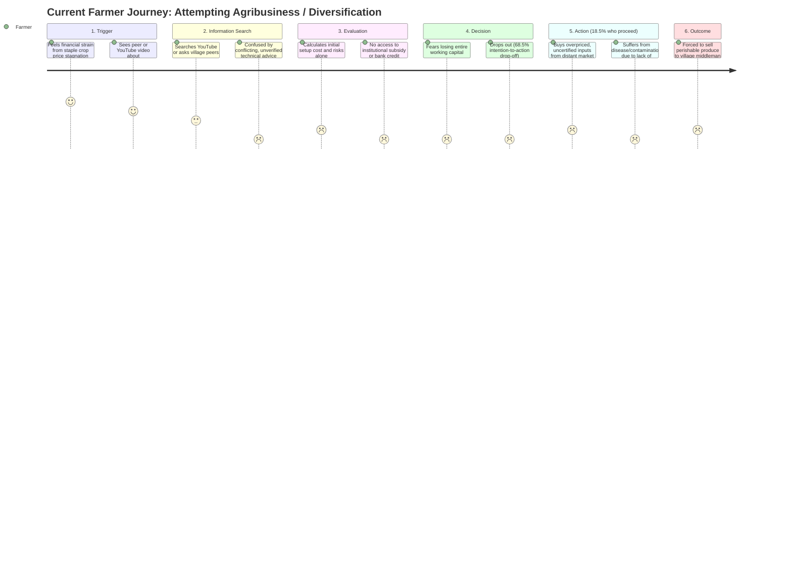

# AgriConnect: Current-State User Journey & Pain Point Workflow

## Current State: How a Smallholder Farmer Attempts Agribusiness Today

### Stage-by-Stage Breakdown

| Stage | Farmer Goal | Current Action & Workaround | Key Pain Point & Friction | AgriConnect Opportunity |
|:---|:---|:---|:---|:---|
| **1. Trigger** | Increase stagnant household income from small land (<5 acres). | Relies on traditional wheat/soybean cycle; incurs recurring seasonal debt for fertilizer/seeds. | Commodity prices are fixed; yield ceiling reached; cannot sustain family needs. | Expose high-ROI, low-acreage micro-enterprise opportunities (Mushroom, Polyhouse, Dairy, Poultry). |
| **2. Information Search** | Understand how to start, investment needed, and potential returns. | Watches random YouTube videos; asks local agro-dealers or peers who tried it. | Information is unstructured, in complex language, or unverified; no localized climate guidance. | Curated, step-by-step vernacular video guides with interactive ROI & cost calculators. |
| **3. Evaluation** | Assess feasibility, input costs, space requirements, and labor. | Mentally estimates cost; visits nearest town to inquire about raw materials. | High fear of failure; lack of transparent input pricing and quality assurance. | Starter Kit blueprints with clear capital requirements (e.g., "Start with ₹3,000 in a 10x10 room"). |
| **4. Decision** | Commit capital and time to initiate the micro-enterprise. | Most farmers (68.5%) drop out due to fear, uncertainty, and zero support. | **Biggest Drop-off Point**: 56.5% cite lack of training & resources. | Guided risk mitigation: peer testimonials, expert hotline, step-by-step checklist. |
| **5. Action & Production** | Execute daily cultivation / livestock management. | Trial and error; guesses watering/temperature/feeding schedules. | Crop contamination, high mortality, or pest infestation due to zero SOP adherence. | Daily task planner, weather-adjusted reminders, and photo-based advisory for diagnosis. |
| **6. Outcome & Sale** | Sell produce at profitable rates. | Transports small volume to local mandi or sells to village aggregator at a discount. | Low bargaining power on small quantities; perishability forces distress sale. | Local buyer connect, restaurant/retailer demand aggregation, and community pooling. |
