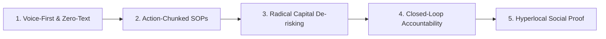

# AgriConnect: Product Strategy

---

## 1. Product Vision & Mission

```
┌────────────────────────────────────────────────────────────────────────────────────────┐
│  PRODUCT VISION                                                                        │
│  "To become India's leading smallholder agri-enterprise platform, transforming         │
│   10 million marginal and small farmers from subsistence commodity growers into        │
│   profitable, climate-resilient, and independent rural entrepreneurs."                 │
├────────────────────────────────────────────────────────────────────────────────────────┤
│  PRODUCT MISSION                                                                       │
│  "To empower small and marginal farmers with zero-friction vernacular execution        │
│   blueprints, affordable starter input kits, and guaranteed local market linkages      │
│   to successfully launch and run a high-margin agribusiness within 60 days."           │
└────────────────────────────────────────────────────────────────────────────────────────┘
```

---

## 2. Target User Segmentation

### A. Primary User (The Core Target — 76.1% of Market)
* **Who**: Small and marginal landholders (holding <5 acres, Mean: 4.12 acres), particularly young and mid-career farmers aged 25–45 (58.7% of survey).
* **Persona Match**: **Ramesh Ahirwar** (Aspirational Young Micro-Entrepreneur).
* **Core Need**: A predictable, low-acreage secondary income stream (₹10,000–₹15,000/month) from Oyster Mushrooms, Polyhouse vegetables, or Poultry that does not depend on seasonal rainfall or volatile commodity mandi prices.

### B. Secondary Users & Beneficiaries
1. **Traditional Marginal & Non-Literate Farmers (38.0% of Survey)**:
   * **Persona Match**: **Babulal Lodhi**.
   * **Core Need**: 100% voice-assisted, low-capex micro-livelihoods (Backyard Poultry, Goat Farming) using farm residues with zero risk to family food security.
2. **Semi-Medium Commercial Diversifiers (20.7% of Survey)**:
   * **Persona Match**: **Virendra Patel**.
   * **Core Need**: Direct B2B commercial buyer matching, multi-mandi real-time price discovery, and bulk input purchasing.
3. **Ecosystem Stakeholders (Supply & Demand Partners)**:
   * **Certified Local Input Suppliers**: Verified rural labs and nurseries providing certified mushroom spawn, organic substrates, and polyhouse hardware.
   * **Semi-Urban Commercial Buyers & Aggregators**: Local restaurants, vegetable wholesalers, hotels, and retail chains seeking steady supplies of fresh, graded high-value produce.

---

## 3. Positioning Statement (Geoffrey Moore Framework)

> **For** small and marginal Indian farmers (holding <5 acres) trapped in low-margin staple farming,  
> **Who** want to start high-income agribusinesses but lack practical know-how and market access,  
> **AgriConnect** is a mobile micro-enterprise incubation platform and marketplace  
> **That** delivers step-by-step vernacular video blueprints, daily visual execution task planners, certified low-cost starter kits, and direct pre-harvest local buyer linkages.  
> **Unlike** generic e-commerce apps (AgroStar, DeHaat) or reactive disease tools (Plantix),  
> **AgriConnect** guarantees an end-to-end vocational pathway that turns 150 sq.ft of unused space into a predictable ₹12,000+ monthly livelihood in 45 days.

---

## 4. Value Proposition Canvas

```
┌────────────────────────────────────────────────────────────────────────────────────────┐
│  CUSTOMER PROFILE (Smallholder Farmer)                                                 │
├────────────────────────────────────────────────────────────────────────────────────────┤
│  • Customer Jobs: Increase household income, feed family, diversify beyond wheat/soya. │
│  • Pains: Stagnant staple prices, 56.5% lack training, fear of capital loss, illiteracy│
│  • Gains: ₹10k-15k supplemental cashflow, social respect, financial independence.      │
├────────────────────────────────────────────────────────────────────────────────────────┤
│  VALUE MAP (AgriConnect Platform)                                                      │
├────────────────────────────────────────────────────────────────────────────────────────┤
│  • Products & Services: Guided Venture Blueprints + Daily SOP Checklist + Micro-Market │
│  • Pain Relievers: Zero-text voice UI, daily visual reminders, <₹4,000 starter kits.   │
│  • Gain Creators: Guaranteed local buyer match, 100% verified ROI, peer community.     │
└────────────────────────────────────────────────────────────────────────────────────────┘
```

---

## 5. Core Product Principles (Ground in Research)

Every feature, UX decision, and architectural choice in AgriConnect must strictly adhere to these 5 research-backed principles:



### 1. Voice-First & Zero-Text (Cognitive Accessibility)
* **Research Rationale**: **38.0% of our respondents are illiterate** (35/92). Text-heavy dropdowns and forms guarantee high bounce rates.
* **Product Rule**: Every user journey must be 100% navigable via regional voice prompts (Hindi/Malvi) and self-explanatory visual icons. Written text is strictly optional.

### 2. Action-Chunked SOPs (Cognitive Simplicity)
* **Research Rationale**: **56.5% cite lack of awareness and training as their primary barrier** (52/92). Traditional academic PDF manuals and long YouTube videos overwhelm farmers.
* **Product Rule**: Replace theoretical courses with bite-sized daily execution checklists (<3 minutes of video per day). Tell the farmer only what to do *today*.

### 3. Radical Capital De-risking (Financial Safety)
* **Research Rationale**: **29.3% cite "Money" (working capital deficit)** as their #1 structural problem; 67.4% find modern tech unaffordable.
* **Product Rule**: All recommended MVP venture blueprints must require **<₹4,000 initial capital**, utilize existing farm waste/spare rooms, and feature an interactive transparent ROI calculator.

### 4. Closed-Loop Accountability (End-to-End Guarantee)
* **Research Rationale**: Providing advisory without market linkages leads to distress sales (21.7% request market support); selling inputs without advisory leads to crop failure.
* **Product Rule**: Never isolate advisory from commerce. Every blueprint must connect: **Knowledge (Advisory) → Certified Supplies (Starter Kit) → Off-take (Buyer Connect)**.

### 5. Hyperlocal Social Proof (Trust Engineering)
* **Research Rationale**: **98.9% received zero government support**; 92.8% discover new techniques via peer word-of-mouth and social media.
* **Product Rule**: Every venture blueprint must feature verified video testimonials from neighbor farmers within a 50 km radius demonstrating real earnings and harvest proof.
