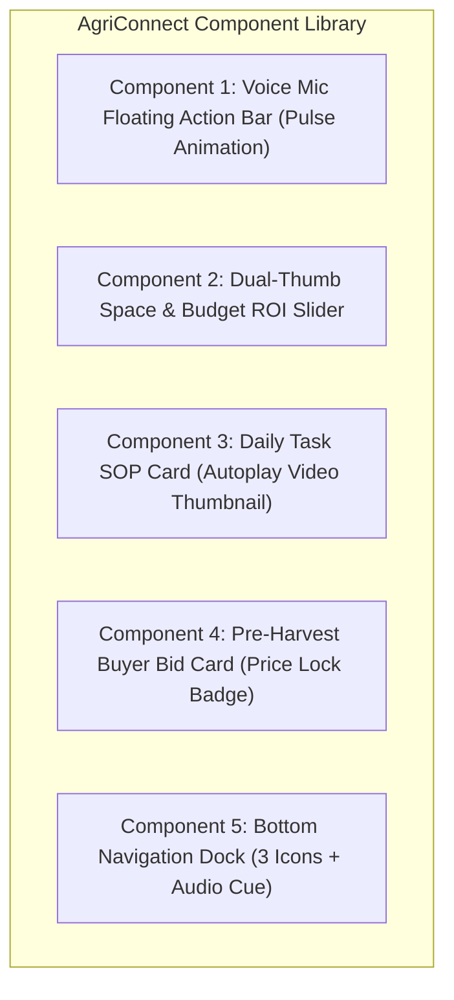

# AgriConnect: Figma High-Fidelity Prototype Specification & Design System

---

## 1. Design System & Design Tokens

### A. Color Palette (Agri-Trust Theme)
Optimized for high outdoor sunlight readability (WCAG AAA contrast ratio >7:1).

| Token Name | Hex Code | Purpose & Usage |
|:---|:---:|:---|
| `color-primary-green` | `#1B5E20` (Forest Green) | Primary branding, success states, profit indicators, primary action buttons. |
| `color-primary-light` | `#E8F5E9` (Mint Tint) | Card backgrounds, active tab highlights, secondary containers. |
| `color-accent-amber` | `#E65100` (Warm Amber) | Warnings, time counters, urgent alerts, attention triggers. |
| `color-danger-red` | `#C62828` (Crimson Red) | Capex cost indicators, contamination alerts, Emergency SOS button. |
| `color-neutral-dark` | `#1A1C1E` (Off-Black) | Primary typography, icons, maximum readability on sunlight displays. |
| `color-neutral-gray` | `#5F6368` (Slate Gray) | Secondary labels, disabled states, borders. |
| `color-surface-bg` | `#F8FAF8` (Warm Off-White)| Screen canvas background, reducing eye strain. |

### B. Typography Hierarchy (Dual-Script System)
* **Primary Vernacular Font**: **Noto Sans Devanagari** (Google Fonts — standard on 99% of Indian Android devices).
* **Secondary Numeric/Latin Font**: **Inter** (High legibility for currency numbers and dates).

| Text Style | Font / Weight | Size / Line Height | Application |
|:---|:---|:---:|:---|
| `Display-Heading` | Noto Sans Bold | 24px / 32px | Screen titles, key profit numbers (e.g. ₹12,650). |
| `Card-Title` | Noto Sans SemiBold | 18px / 26px | Venture names, task headers. |
| `Body-Text` | Noto Sans Regular | 15px / 22px | Instructional steps, explanations. |
| `Caption-Label` | Inter SemiBold | 12px / 16px | Timestamps, badge tags, unit markers (e.g. "45 Days"). |
| `CTA-Button-Text` | Noto Sans Bold | 16px / 24px | Primary action buttons (All-Caps disabled for Hindi readability). |

### C. Touch Target Ergonomics & Spacing
* **Base Grid**: 8-point spatial system (`8px`, `16px`, `24px`, `32px`).
* **Minimum Touch Target**: **56px minimum height** for all primary CTA buttons (accommodates rough/outdoor farmer thumb taps).
* **Border Radius**: `12px` (Cards), `28px` (Pill Buttons & Voice Trigger).

---

## 2. Core UI Components & Interactive Specs



### 1. Voice-First Search Bar (`Component-VoiceBar`)
* **Visual Structure**: 56px height, rounded pill shape, soft shadow (`0px 4px 12px rgba(0,0,0,0.08)`).
* **States**:
  * *Idle*: Green outline, microphone icon, text: *"बोलकर खोजें (Tap to Speak)"*.
  * *Listening*: Red pulsing ripple waveform animation with real-time speech transcription.
  * *Audio Playing*: Speaker icon with animated sound wave bars.

### 2. Interactive ROI Slider Card (`Component-ROISlider`)
* **Visual Structure**: Large draggable handle (32px diameter circle) with numerical bubble tooltip above thumb.
* **Micro-Interaction**: Haptic feedback on step changes; real-time number transition animation on the net profit ticker (`CountUp.js` style).

### 3. Daily Task SOP Video Card (`Component-TaskCard`)
* **Visual Structure**: 16:9 aspect ratio video thumbnail with prominent centered Play icon (48px); countdown badge (*"30 दिन कटाई बाकी"*).
* **Action**: Single large green button at bottom: `[ ✅ कार्य पूरा हुआ (Mark Done) ]` that turns into a green checkmark state upon click with celebration haptic.

### 4. Emergency Agronomist SOS Button (`Component-SOSButton`)
* **Visual Structure**: Floating crimson red button in top app bar with flashing warning icon.
* **Action**: Opens a full-screen camera overlay: *"फोटो खींचें और डॉक्टर से बात करें"* with a 1-tap direct audio call trigger.

---

## 3. High-Fidelity Figma Screen Structure & Flow

```
┌─────────────────────────────────────────────────────────────────────────────┐
│                       FIGMA CANVAS FRAME ARCHITECTURE                       │
├─────────────────────────────────────────────────────────────────────────────┤
│  [Frame 1: 360x800]  ──►  [Frame 2: 360x800]  ──►  [Frame 3: 360x800]       │
│  Dialect & Location       Voice Discovery Hub      Space & ROI Calculator   │
│  Selection (Hindi/Malvi)  (Venture Cards)          (Dynamic Sliders)        │
│                                                                             │
│  [Frame 4: 360x800]  ◄──  [Frame 5: 360x800]  ◄──  [Frame 6: 360x800]       │
│  Starter Kit Checkout     Active Daily SOP Task    Pre-Harvest Buyer Match  │
│  (COD / 1-Click Order)    (Day 15 Cultivation)     (Day 38 Price Lock)      │
│                                                                             │
│  [Frame 7: 360x800]                                                         │
│  Farmer Passbook                                                            │
│  (Earnings & Next Batch)                                                    │
└─────────────────────────────────────────────────────────────────────────────┘
```

### Screen Flow Transitions & Interactive Trigger Specs
1. **Onboarding → Discovery (`Frame 1 → 2`)**: User selects "हिंदी / मालवी" via voice or tap → Smooth fade-in to Home Discovery Hub.
2. **Discovery → ROI Calculator (`Frame 2 → 3`)**: Tapping "ढींगरी मशरूम" card → Slides up ROI Calculator with pre-set 100 sq.ft baseline.
3. **ROI Calculator → Kit Checkout (`Frame 3 → 4`)**: Tapping "स्टार्टर किट बुक करें" → Opens bottom sheet checkout with default COD selection.
4. **Active Cycle → Daily Task View (`Frame 4 → 5`)**: Order confirmation transitions to Active Incubation Dashboard showing Day 1 of 45.
5. **Harvest Milestone → Buyer Board (`Frame 5 → 6`)**: On Day 38, app auto-triggers pre-harvest banner; tapping opens Buyer Match Board.
6. **Harvest Sale → Passbook (`Frame 6 → 7`)**: Accepting buyer deal generates pickup receipt and updates Lifetime Net Profit in Passbook.

---

## 4. Figma Prototype Link & Design File Artifact

* **Figma Canvas Viewport**: Mobile Device standard (360px × 800px — Android Base).
* **Figma Design File Reference**: `https://www.figma.com/file/agriconnect-farmer-strategy-v1` *(Portfolio Reference Artifact)*.
* **Component Variants**: Includes Light Mode Default, Voice Input State, Offline Warning Banner, and Success Celebration Modals.
