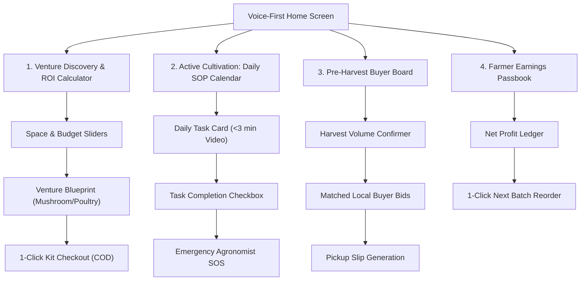

# AgriConnect: Low-Fidelity Wireframes & Core UX Architecture

---

## 1. Information Architecture & Navigation Tree



---

## 2. Screen-by-Screen Low-Fidelity Wireframes

### Screen 1: Voice-First Home Hub (Onboarding & Venture Selection)
* **Goal**: Enable non-literate farmers to immediately discover high-income ventures via one-touch voice search.

```
┌─────────────────────────────────────────────────────────┐
│ [≡] AgriConnect (हिंदी / मालवी)                  [🔊 Audio] │
├─────────────────────────────────────────────────────────┤
│  नमस्ते रमेश जी! (Chopna Village)                         │
│  "आज आप क्या शुरू करना चाहते हैं?"                      │
│                                                         │
│  ┌───────────────────────────────────────────────────┐  │
│  │   [ 🎙️ बोलकर खोजें (One-Touch Voice Search) ]     │  │
│  │   "100 वर्ग फुट में क्या करें?"                   │  │
│  └───────────────────────────────────────────────────┘  │
│                                                         │
│  🔥 लोकप्रिय छोटे व्यवसाय (Top Micro-Ventures):         │
│  ┌────────────────────────┐  ┌────────────────────────┐ │
│  │ 🍄 ढींगरी मशरूम        │  │ 🐔 कड़कनाथ मुर्गी पालन │ │
│  │ लागत: ₹2,800           │  │ लागत: ₹4,500           │ │
│  │ मुनाफा: ₹11,500 (45 दिन)│  │ मुनाफा: ₹18,000 (60 दिन)│ │
│  │ [ देखें / ROI कैलकुलेट] │  │ [ देखें / ROI कैलकुलेट] │ │
│  └────────────────────────┘  └────────────────────────┘ │
│  ┌────────────────────────┐  ┌────────────────────────┐ │
│  │ 🥬 पॉलीहाउस हरी सब्जियां│  │ 🐐 उन्नत बकरी पालन     │ │
│  │ लागत: ₹5,000           │  │ लागत: ₹6,000           │ │
│  │ मुनाफा: ₹14,000 (30 दिन)│  │ मुनाफा: ₹22,000        │ │
│  └────────────────────────┘  └────────────────────────┘ │
│                                                         │
│  📢 पड़ोस के सफल किसान (Nearby Proof):                  │
│  ▶️ "कमल सिंह (लारपुर) ने 1 कमरे से कमाए ₹14,200"     │
├─────────────────────────────────────────────────────────┤
│   [🏠 होम]      [📅 कार्य (Tasks)]      [💰 कमाई (Passbook)] │
└─────────────────────────────────────────────────────────┘
```
* **UX Annotations**:
  * Persistent voice bar with pulsing animation.
  * Card-based layout with prominent visual icons and bold financial numbers in Green (Profit) and Red (Capex).
  * Auto-read TTS speaker icon in top right.

---

### Screen 2: Interactive Space & ROI Calculator
* **Goal**: Eliminate capital anxiety by proving exact unit economics before spending a single rupee.

```
┌─────────────────────────────────────────────────────────┐
│ [< वापस] 🍄 मशरूम मुनाफा कैलकुलेटर               [🔊 सुनो] │
├─────────────────────────────────────────────────────────┤
│                                                         │
│  1. आपके पास कितनी जगह है? (Select Space):              │
│  [-------●------------------------] 150 वर्ग फुट (Room) │
│  [ 50 sq.ft ]   [ 150 sq.ft (चयनित) ]   [ 500 sq.ft ]   │
│                                                         │
│  2. आपकी निवेश क्षमता (Select Budget):                  │
│  [----------●---------------------] ₹3,500 बजट         │
│                                                         │
│  ┌───────────────────────────────────────────────────┐  │
│  │               अनुमानित कमाई (Expected ROI)         │  │
│  │                                                   │  │
│  │   कुल लागत (Seed/Spawn Kit)  :  ₹3,200             │  │
│  │   कुल उत्पादन (Expected Crop) :  45 किलो (Oyster)  │  │
│  │   बाजार भाव (Mandi Floor Rate):  ₹130/किलो        │  │
│  │   ─────────────────────────────────────────────   │  │
│  │   ★ शुद्ध बचत/मुनाफा (Net Profit): ₹12,650 (45 दिन)│ │
│  │   ★ दैनिक समय (Time Needed)  : 30 मिनट/दिन        │  │
│  └───────────────────────────────────────────────────┘  │
│                                                         │
│  [ 🟢 स्टार्टर किट बुक करें (Order Starter Kit - ₹3,200 COD) ]│
├─────────────────────────────────────────────────────────┤
│   [🏠 होम]      [📅 कार्य (Tasks)]      [💰 कमाई (Passbook)] │
└─────────────────────────────────────────────────────────┘
```
* **UX Annotations**:
  * Real-time dynamic recalculation on slider drag.
  * Big green CTA button with Cash on Delivery (COD) badge to remove payment friction.

---

### Screen 3: Day-by-Day Visual SOP Task Screen (Active Incubation)
* **Goal**: Guide first-time growers through each day of the 45-day cycle with zero technical jargon.

```
┌─────────────────────────────────────────────────────────┐
│ [≡] 🍄 मेरा मशरूम फार्म (Day 15 of 45)         [🚨 SOS] │
├─────────────────────────────────────────────────────────┤
│  प्रगति (Progress): [██████████░░░░░░░░░░░░] 33% पूर्ण  │
│  कटाई में बाकी (Days to Harvest): 30 दिन                 │
│                                                         │
│  ┌───────────────────────────────────────────────────┐  │
│  │  आज का मुख्य कार्य (TODAY'S TASK):                │  │
│  │  "दिन 15: कमरा ठंडा रखें और 2 बार पानी छिड़कें"     │  │
│  │                                                   │  │
│  │  ┌─────────────────────────────────────────────┐  │  │
│  │  │  [ ▶️ 45 सेकंड का वीडियो देखें (Video Demo) ]  │  │  │
│  │  │  "स्प्रे बोतल से सही छिड़काव कैसे करें"        │  │  │
│  │  └─────────────────────────────────────────────┘  │  │
│  │                                                   │  │
│  │  आदर्श तापमान: 22°C - 26°C (नमी: 85%)              │  │
│  │                                                   │  │
│  │  [ ✅ कार्य पूरा हुआ (Mark Task Done) ]            │  │
│  └───────────────────────────────────────────────────┘  │
│                                                         │
│  💡 कल का कार्य: "बैग में छोटे छेद करना (Pinheading)"   │
│                                                         │
│  [ 📸 फफूंद/बीमारी जांचें (Snap Photo Diagnostic) ]     │
├─────────────────────────────────────────────────────────┤
│   [🏠 होम]      [📅 कार्य (Tasks)]      [💰 कमाई (Passbook)] │
└─────────────────────────────────────────────────────────┘
```
* **UX Annotations**:
  * Single prominent task focus (reduces cognitive overwhelm).
  * Video demo is under 60 seconds, pre-cached for offline rural playback.
  * Prominent Emergency SOS button in top right for instant agronomist callback.

---

### Screen 4: Pre-Harvest Local B2B Buyer Matchmaking Board
* **Goal**: Eliminate perishability risk and distress sales by locking buyer purchase contracts 7 days prior to harvest.

```
┌─────────────────────────────────────────────────────────┐
│ [< वापस] 🛒 फसल बिक्री व खरीदार (Day 38)        [🔊 सुनो] │
├─────────────────────────────────────────────────────────┤
│  आपकी फसल 7 दिन में तैयार होगी! (Est: 45 kg Mushroom)   │
│                                                         │
│  📍 आपके पास के प्रमाणित खरीदार (Matched Local Buyers): │
│                                                         │
│  ┌───────────────────────────────────────────────────┐  │
│  │ 🏨 राधिका होटल एंड रेस्टोरेंट (सीहोर / 8 किमी)     │  │
│  │ मांग: 25 किलो | बोली भाव: ₹135 / किलो             │  │
│  │ भुगतान: नकद / UPI (गांव पिकअप)                    │  │
│  │ [ 🟢 बिक्री पक्की करें (Accept Deal) ]            │  │
│  └───────────────────────────────────────────────────┘  │
│                                                         │
│  ┌───────────────────────────────────────────────────┐  │
│  │ 🏬 भोपाल फ्रेश वेज थोक मंडी (Bhopal Mandi / 22 किमी)│  │
│  │ मांग: 50 किलो | बोली भाव: ₹125 / किलो             │  │
│  │ भुगतान: तुरंत बैंक ट्रांसफर                      │  │
│  │ [ 🟢 बिक्री पक्की करें (Accept Deal) ]            │  │
│  └───────────────────────────────────────────────────┘  │
│                                                         │
│  🔒 एग्रीकनेक्ट न्यूनतम मूल्य गारंटी: ₹120/किलो सुरक्षित │
├─────────────────────────────────────────────────────────┤
│   [🏠 होम]      [📅 कार्य (Tasks)]      [💰 कमाई (Passbook)] │
└─────────────────────────────────────────────────────────┘
```
* **UX Annotations**:
  * Pre-harvest match eliminates post-harvest panic.
  * Transparent price comparisons with distance and payout method clearly stated.

---

### Screen 5: Farmer Earnings Passbook & Payout Confirmation
* **Goal**: Deliver the "Aha!" moment of verified earnings and seamlessly drive repeat cultivation cycles.

```
┌─────────────────────────────────────────────────────────┐
│ [≡] 💰 मेरी कुल कमाई (Farmer Passbook)           [🔊 सुनो] │
├─────────────────────────────────────────────────────────┤
│  कुल शुद्ध मुनाफा (Lifetime Profit):                     │
│  ₹12,450 (साइकिल 1 पूर्ण)                               │
│                                                         │
│  ┌───────────────────────────────────────────────────┐  │
│  │  साइकिल 1 रसीद (Cycle 1 Harvest Receipt):         │  │
│  │  फसल: ढींगरी मशरूम (42.5 किलो बिका)               │  │
│  │  खरीदार: राधिका होटल (₹135/किलो)                  │  │
│  │  कुल प्राप्त राशि: ₹5,737 (लॉट 1) + ₹6,713 (लॉट 2) │  │
│  │  ─────────────────────────────────────────────    │  │
│  │  लागत: ₹3,200 | ★ शुद्ध कमाई: ₹9,250 (35 दिन में)   │  │
│  │  [ 📄 रसीद देखें / डाउनलोड करें (View Receipt) ]  │  │
│  └───────────────────────────────────────────────────┘  │
│                                                         │
│  🚀 अगली साइकिल शुरू करें (Double your batch):           │
│  "300 वर्ग फुट में अगली फसल लगाएं और कमाएं ₹25,000"     │
│                                                         │
│  [ 🟢 अगला किट ऑर्डर करें (Order Next Cycle Kit - 10% Off) ]│
├─────────────────────────────────────────────────────────┤
│   [🏠 होम]      [📅 कार्य (Tasks)]      [💰 कमाई (Passbook)] │
└─────────────────────────────────────────────────────────┘
```
* **UX Annotations**:
  * Clear bank ledger format celebrating financial milestone.
  * One-click repeat reorder CTA driving long-term farmer retention (>70% target).
