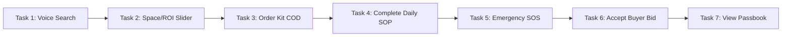

# AgriConnect: User Testing Plan & Usability Study Protocol

---

## 1. Testing Objectives & Core Hypotheses

### Objective
To evaluate the usability, cognitive accessibility, and trust conversion of the AgriConnect v1.0 prototype with target rural smallholder farmers across varying literacy levels.

### Key Hypotheses to Test
* **H1 (Voice-First Accessibility)**: Non-literate farmers (Persona 2: Babulal) can independently complete venture discovery and task tracking using voice search and audio prompts with >85% task completion rate.
* **H2 (ROI Comprehension)**: Farmers can accurately distinguish between *Gross Revenue* and *Net Profit* on the dynamic slider within 30 seconds of interaction.
* **H3 (Trust & COD Conversion)**: Offering Cash on Delivery (COD) and displaying a localized mandi floor price guarantee eliminates purchase hesitation for Starter Kits.

---

## 2. Participant Cohort Composition (N=10)

Recruited from surveyed village clusters (Chopna, Lalpur, Mau) matching our 3 research personas:

| Participant ID | Age | Village | Education | Landholding | Persona Alignment | Primary Device |
|:---:|:---:|:---:|:---:|:---:|:---|:---|
| **P01** | 26 | Chopna | 12th Pass | 1.2 Acres | Persona 1 (Ramesh - Young Aspirant) | Redmi 9A (Personal 4G) |
| **P02** | 29 | Jalalpura | 10th Pass | 2.0 Acres | Persona 1 (Ramesh - Young Aspirant) | Realme C11 (Personal 4G) |
| **P03** | 25 | Chopna | Graduate | 1.5 Acres | Persona 1 (Ramesh - Young Aspirant) | Vivo Y20 (Personal 4G) |
| **P04** | 31 | Mau | 10th Pass | 3.0 Acres | Persona 1 (Ramesh - Young Aspirant) | Samsung M02 (Personal 4G) |
| **P05** | 48 | Lalpur | Illiterate | 1.5 Acres | Persona 2 (Babulal - Marginal Squeezer) | Shared Family Phone |
| **P06** | 52 | Chopna | Illiterate | 2.5 Acres | Persona 2 (Babulal - Marginal Squeezer) | Keypad + Son's Phone |
| **P07** | 42 | Mau | Illiterate | 1.0 Acre | Persona 2 (Babulal - Marginal Squeezer) | Shared Family Phone |
| **P08** | 50 | Lalpur | Primary (Class 4) | 2.0 Acres | Persona 2 (Babulal - Marginal Squeezer) | Itel Vision 1 (Basic 4G) |
| **P09** | 34 | Lakadiya | Graduate (B.Com) | 7.5 Acres | Persona 3 (Virendra - Commercial Diversifier) | OnePlus Nord (Personal 5G) |
| **P10** | 36 | Tajpura | 12th Pass | 6.0 Acres | Persona 3 (Virendra - Commercial Diversifier) | Redmi Note 11 (Personal 4G) |

---

## 3. Testing Methodology & Environment

* **Format**: In-person, moderated usability testing conducted in village community centers (Chaupal / Panchayat Bhavan).
* **Language**: Conducted entirely in conversational **Hindi & Malvi dialects**.
* **App State**: Interactive mobile prototype running on local test devices (simulating outdoor bright sunlight and intermittent 2G/3G network conditions).
* **Observer Role**: Neutral observation; "Think Aloud" protocol adapted for rural farmers (*"Bhaiya, aap jo bhi dekh rahe hain aur soch rahe hain, bolte jaiye"*).

---

## 4. The 7 Usability Testing Tasks

### Task 1: Onboarding & Voice-Triggered Discovery
* **Scenario**: *"Imagine you want to start a new business in your spare room. Use your voice to find what you can grow."*
* **Success Criteria**: Farmer taps the microphone icon, speaks in Hindi/Malvi, and lands on the Mushroom Blueprint without typing.

### Task 2: Calculating Profit for a 150 sq.ft Space
* **Scenario**: *"Check how much money you need to invest and how much profit you will earn if you have a 150 sq.ft room."*
* **Success Criteria**: Farmer drags the space slider to 150 sq.ft and identifies the Net Profit number (₹12,650).

### Task 3: 1-Click Starter Kit Ordering (COD)
* **Scenario**: *"Order the required seed/spawn kit for delivery to your village with payment on delivery."*
* **Success Criteria**: Farmer taps the primary CTA, confirms Cash on Delivery, and sees the confirmation screen.

### Task 4: Daily SOP Execution & Video Playback
* **Scenario**: *"Today is Day 15 of your crop cycle. Find out what work you need to do today and mark it finished."*
* **Success Criteria**: Farmer navigates to the Tasks tab, watches the 45-second video demo, and taps "कार्य पूरा हुआ".

### Task 5: Emergency Agronomist SOS Trigger
* **Scenario**: *"You notice yellow spots on your crop bags. Request doctor assistance immediately."*
* **Success Criteria**: Farmer locates the top-right SOS button and triggers camera photo capture within 15 seconds.

### Task 6: Pre-Harvest Buyer Bid Selection
* **Scenario**: *"Your harvest is ready in 7 days. Select a local buyer who will buy your mushrooms at the highest price."*
* **Success Criteria**: Farmer reviews matched buyers, compares ₹135/kg vs ₹125/kg, and accepts the Radhika Hotel offer.

### Task 7: Passbook Review & Next Cycle Reorder
* **Scenario**: *"Check your total earnings from Cycle 1 and reorder the kit for your next crop."*
* **Success Criteria**: Farmer opens the Passbook tab, verifies net profit receipt, and taps the reorder CTA.

---

## 5. Quantitative Usability Metrics & Evaluation Criteria

1. **Task Completion Rate (TCR)**: Target >85% across all tasks.
2. **Time on Task (ToT)**: Benchmark time per flow (e.g. <45 seconds for Starter Kit booking).
3. **Single Ease Question (SEQ)**: 1 to 7 Likert scale administered via smiley icons after each task (*1 = Very Difficult, 7 = Very Easy*).
4. **System Usability Scale (SUS)**: Target score >75 (Industry rural benchmark: >68).
5. **Voice Recognition Accuracy**: % of spoken dialect queries successfully matched without error prompts.

---

## 6. Pre-Test & Post-Test Interview Guide

### Pre-Test Questions
1. *"Have you ever tried using an agricultural app on your phone? If yes, what did you like or dislike?"*
2. *"When you want to learn how to grow a new crop, whom do you trust the most?"*
3. *"What is your biggest fear when trying a new farming method?"*

### Post-Test Debrief Questions
1. *"Was there any point where you felt confused or worried about your money?"*
2. *"Did the daily task videos feel easy to follow, or were they too fast?"*
3. *"Would you trust the buyer shown in the app to collect your crop and pay you on time?"*
4. *"If this app was available today in your village, would you use it to start mushroom farming?"*
