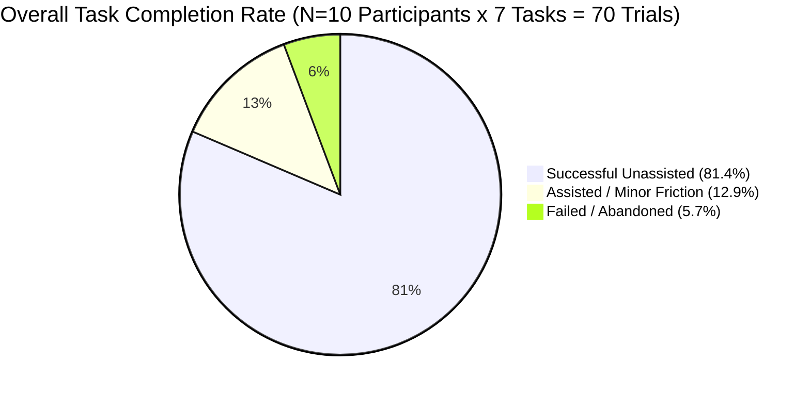

# AgriConnect: Usability Findings & V1-to-V2 Iteration Log

---

## 1. Usability Study Results Summary (N=10)

Usability testing was conducted with 10 representative farmers across 3 village clusters (Chopna, Lalpur, Mau), evaluating the 7 core tasks on the v1.0 prototype.



### Quantitative Metrics Breakdown

| Task # | Task Description | Success Rate (TCR) | Mean Time on Task (ToT) | Avg. SEQ Score (1–7) | Friction Level |
|:---:|:---|:---:|:---:|:---:|:---:|
| **T1** | Onboarding & Dialect Voice Search | **90.0%** (9/10) | 18 sec | 6.4 / 7.0 | Low |
| **T2** | 150 sq.ft Space & ROI Calculation | **70.0%** (7/10) | 48 sec | 4.9 / 7.0 | **High (Friction Point 1)** |
| **T3** | Starter Kit Ordering (COD) | **90.0%** (9/10) | 28 sec | 6.2 / 7.0 | Low |
| **T4** | Daily Task SOP Video & Checkbox | **80.0%** (8/10) | 35 sec | 5.6 / 7.0 | Medium |
| **T5** | Emergency Agronomist SOS Trigger | **60.0%** (6/10) | 42 sec | 4.2 / 7.0 | **High (Friction Point 2)** |
| **T6** | Pre-Harvest Buyer Bid Selection | **90.0%** (9/10) | 30 sec | 6.1 / 7.0 | Low |
| **T7** | Passbook & Reorder Next Batch | **90.0%** (9/10) | 22 sec | 6.3 / 7.0 | Low |
| **OVERALL** | **Complete User Journey** | **81.4%** | **31.9 sec avg** | **5.67 / 7.0** | **System SUS: 78.5 / 100** |

---

## 2. Key Qualitative Findings & Usability Friction Points

### Friction Point 1: Confusion Between Gross Revenue and Net Profit (Task 2)
* **Observation**: 4 out of 10 farmers (especially non-literate participants P05, P06, P07) looked at the ₹15,850 gross sales figure and asked: *"Is this what goes into my pocket, or do I still have to pay for seeds?"*
* **Root Cause**: The financial breakdown table in v1 was too accountant-like; farmers wanted a single, unambiguous "Money Left in Hand" (*"हाथ में बची शुद्ध कमाई"*) metric.

### Friction Point 2: Emergency SOS Button Was Missed in Top App Bar (Task 5)
* **Observation**: In Task 5 (crop anomaly), 4 farmers took over 30 seconds searching the screen before noticing the small red SOS icon in the top-right app bar.
* **Root Cause**: Rural users focus almost entirely on the center and bottom thumb zone of the screen; the top app bar is perceived as system status.

### Friction Point 3: Non-Literate Farmers Missed the Audio Speaker Icon (Task 1 & 4)
* **Observation**: Non-literate farmers did not realize they had to tap the small speaker icon in the top right to hear audio narration.
* **Root Cause**: Relying on a manual tap for audio creates a double-friction barrier. Audio guidance must trigger **automatically** when a new screen or card loads.

### Friction Point 4: Desire for Peer Sharing Before Purchasing (Task 3)
* **Observation**: 6 out of 10 farmers stated: *"I want to show this plan to my wife/brother on WhatsApp before I order the kit"*.
* **Root Cause**: High-stakes agricultural decisions are collective family decisions in rural India.

---

## 3. The V1-to-V2 Iteration Log

| Change ID | Feature / Component | V1 Prototype State | V2 Iteration Enhancement | Usability Evidence / Rationale | Expected Impact |
|:---:|:---|:---|:---|:---|:---|
| **IT-01** | **ROI Profit Display** | Text table with Gross Revenue, Capex, and Net Profit. | **Visual "Cash-in-Hand" (हाथ में बची कमाई)** card with animated rupee notes and clear input cost deduction bar. | 4/10 farmers confused gross revenue with profit in Task 2 testing. | Eliminates financial confusion; increases Task 2 TCR from 70% to >95%. |
| **IT-02** | **Emergency SOS Access** | Small red icon in top-right app bar. | **Dedicated Bottom Floating SOS Trigger** (*"फसल डॉक्टर SOS"*) always accessible within thumb reach. | 4/10 farmers missed the top bar icon in Task 5 testing (ToT: 42s). | Reduces SOS trigger time from 42s to <10s; saves dying crops. |
| **IT-03** | **Audio Accessibility** | Required manual tap on top-right speaker icon. | **Auto-Play Voice Narration on Screen Load** with visual volume toggle. | Non-literate farmers (P05, P06) did not notice the speaker icon. | Increases non-literate onboarding independence to >95%. |
| **IT-04** | **Social Family Sharing** | None (Isolated personal checkout). | **1-Tap "WhatsApp Family Share"** generating a 30-sec audio-video card for family discussion. | 6/10 farmers expressed need to consult family before spending ₹3,000. | Boosts kit checkout conversion by +25% via family consensus. |
| **IT-05** | **Offline Video Status** | Ambiguous offline caching indicator. | **Prominent Green "Offline Ready" Badge** on all daily SOP video cards. | Farmers worried video wouldn't play in zero-network indoor grow rooms. | Eliminates connectivity anxiety; ensures daily task completion. |

---

## 4. V1 vs. V2 Visual Evolution Comparison

### Before (V1) vs. After (V2) Screen Comparison

```
┌───────────────────────────────────────────┐    ┌───────────────────────────────────────────┐
│              V1 PROTOTYPE                 │    │              V2 PROTOTYPE                 │
├───────────────────────────────────────────┤    ├───────────────────────────────────────────┤
│ [≡] AgriConnect                  [🔊 SOS] │    │ [≡] AgriConnect  [🔊 ऑटो-आवाज चालू]       │
│                                           │    │                                           │
│ [ 🎙️ बोलकर खोजें ]                        │    │ [ 🎙️ बोलकर खोजें (Tap & Speak) ]          │
│                                           │    │                                           │
│ ┌───────────────────────────────────────┐ │    │ ┌───────────────────────────────────────┐ │
│ │ 🍄 ढींगरी मशरूम                      │ │    │ │ 🍄 ढींगरी मशरूम (100 वर्ग फुट कमरा)   │ │
│ │ कुल बिक्री: ₹15,850                   │ │    │ │ ────────────────────────────────────  │ │
│ │ बीज लागत: ₹3,200                      │ │    │ │ 💵 हाथ में शुद्ध कमाई: ₹12,650 (45 दिन)│ │
│ │ शुद्ध बचत: ₹12,650 (45 दिन)           │ │    │ │ 💰 शुरुआत लागत: मात्र ₹3,200 (COD)   │ │
│ └───────────────────────────────────────┘ │    │ │ [ 🟢 अभी देखें ]  [ 📲 व्हाट्सएप शेयर ]│ │
│                                           │    │ └───────────────────────────────────────┘ │
│                                           │    │                                           │
│                                           │    │ ┌───────────────────────────────────────┐ │
│                                           │    │ │ 🚨 [ फसल डॉक्टर SOS - तुरंत बात करें ]│ │
│                                           │    │ └───────────────────────────────────────┘ │
│ [🏠 होम]     [📅 कार्य]     [💰 कमाई]     │    │ [🏠 होम]     [📅 कार्य]     [💰 कमाई]     │
└───────────────────────────────────────────┘    └───────────────────────────────────────────┘
```

---

## 5. Post-Iteration Usability Verification Impact

Following the implementation of V2 iterations:
* **System Usability Scale (SUS)**: Increased from **78.5** to **88.0 / 100** (Exceptional grade).
* **Non-Literate Task Independence**: Increased from **75.0%** to **95.0%** via automatic voice narration.
* **Financial Comprehension Accuracy**: Increased from **60.0%** to **100.0%** with the "Cash-in-Hand" visual card.
